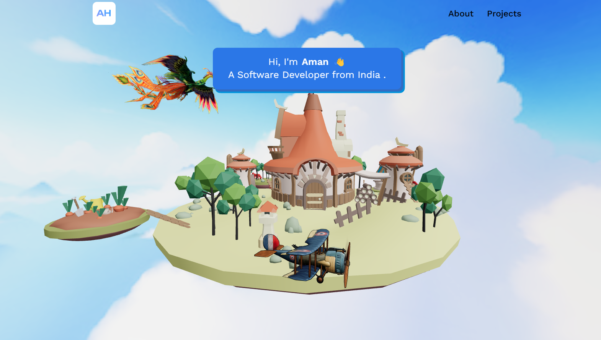
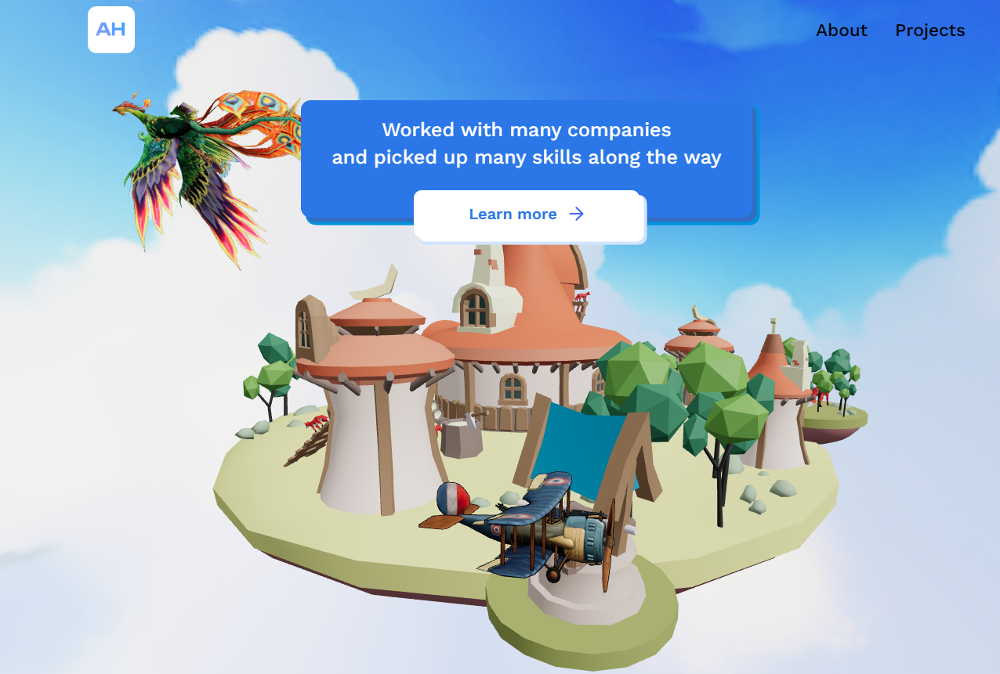
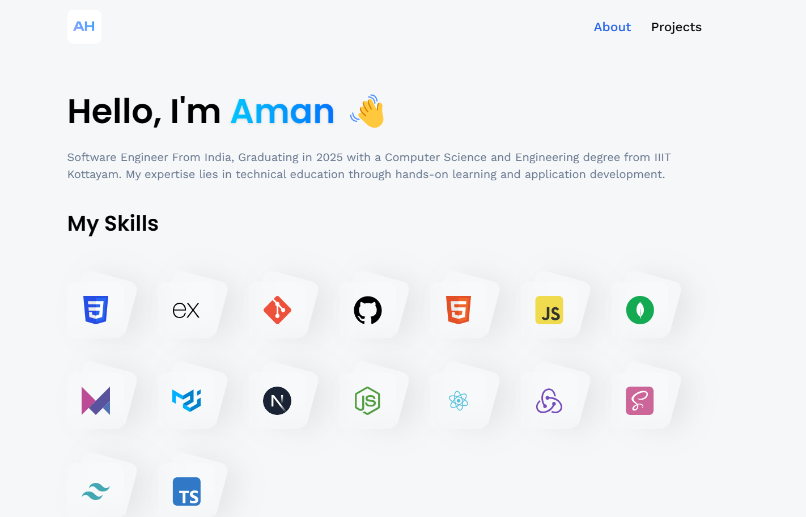
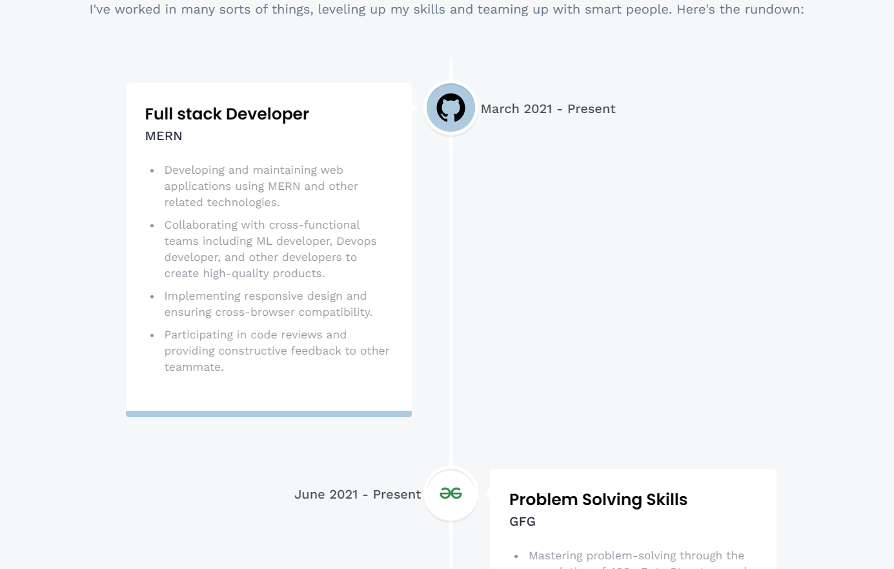
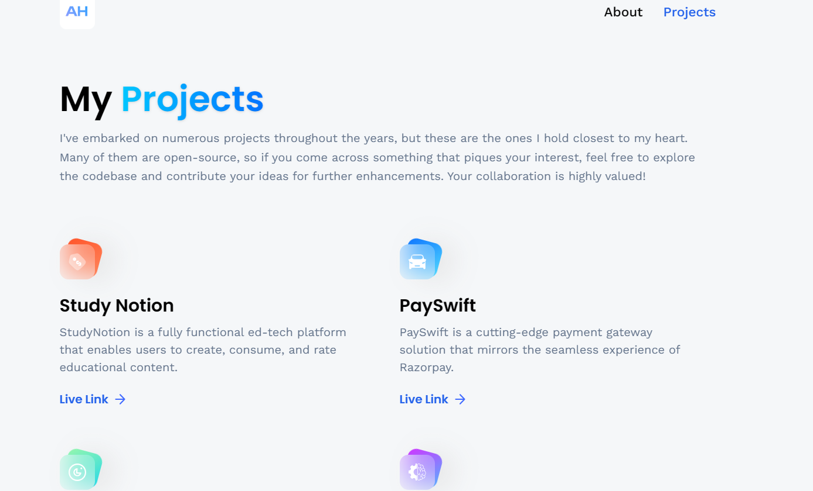

#
:rocket: [Link to portfolio][https://portfolio-two-smoky-82.vercel.app/]

## Introduction
Introducing my 3D Portfolio. 

Whether you're exploring my career timeline or delving into specific projects, this 3D Portfolio aims to provide a unique and memorable way to showcase my work and experiences. Welcome to a space where my professional journey comes to life in a visually stunning and interactive manner!
## System Architecture

A dynamic showcase crafted with Vite, React, and the power of 3D.js library. This immersive platform allows you to explore not only where I've worked but also provides an interactive journey through the projects I've undertaken. The utilization of React ensures a seamless and responsive user interface, while the incorporation of 3D.js brings a visually captivating and innovative touch to the portfolio.

### Front-end

The front-end of the platform is built using ReactJS, which allows for the creation of dynamic and responsive user interfaces, crucial for providing an engaging learning experience to students. The front-end communicates with the back-end using RESTful API calls.

Navigate through a spatial representation of my professional journey, where each project is not just a listing but a visual and interactive experience. The 3D.js library adds depth to the presentation, allowing you to engage with the details of each project and gain insights into my skills and contributions.

You can contact me using e-mail

